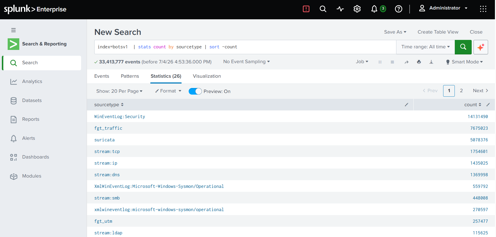
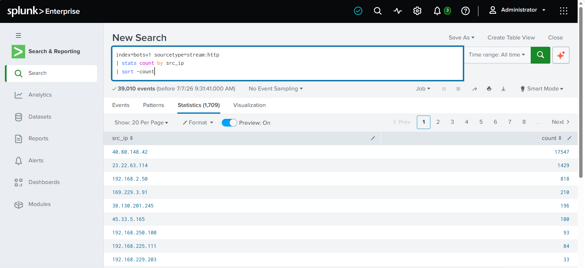
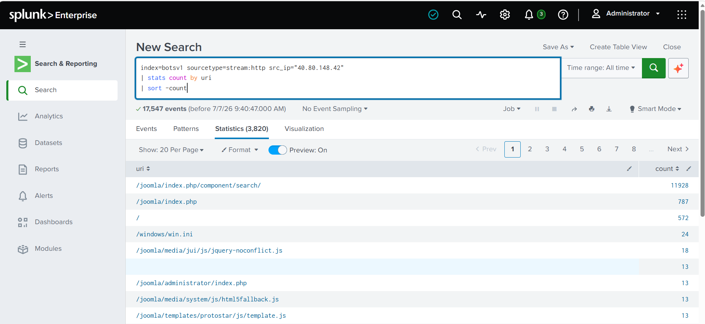
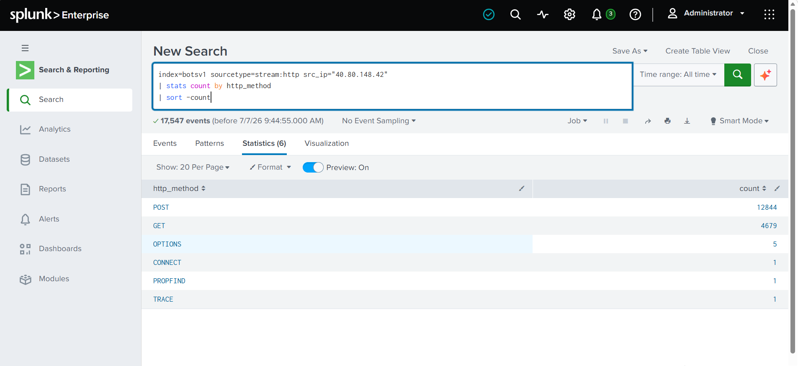
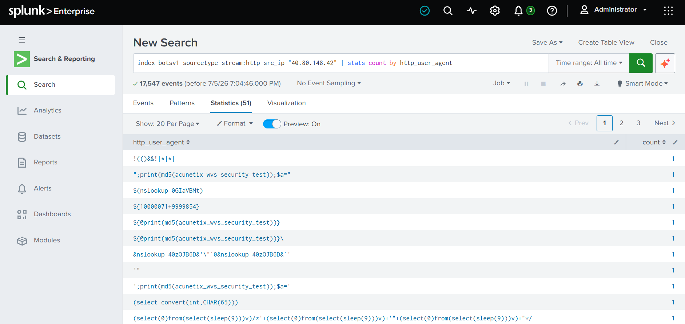
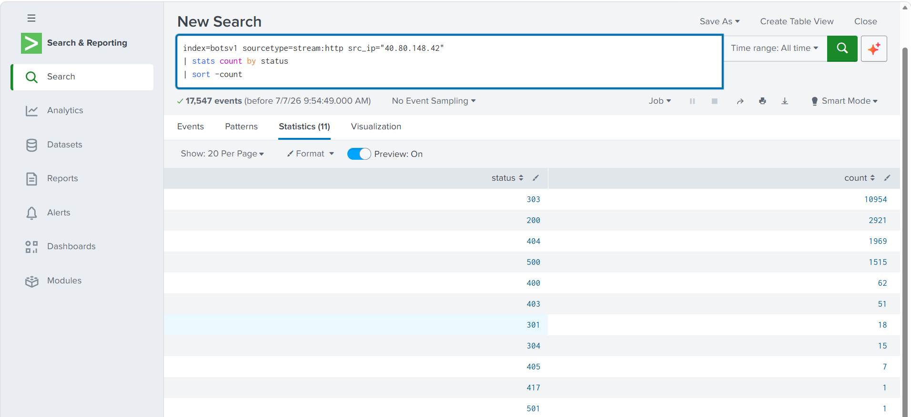
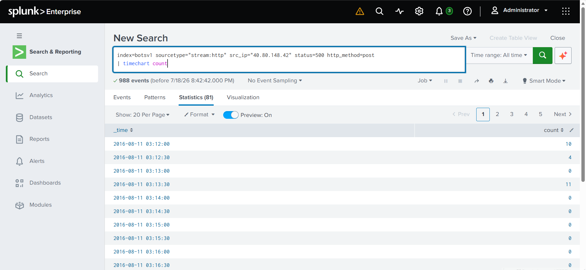

# Splunk Threat Hunting Investigation using BOTSv1 Dataset

**Alternative titles:**
- Web Attack Investigation using Splunk Enterprise
- SOC Threat Hunting Lab – BOTSv1 Dataset
- Splunk HTTP Log Analysis and Threat Hunting

## Executive Summary

This project documents a threat hunting investigation performed using Splunk Enterprise and the Boss of the SOC Version 1 (BOTSv1) dataset. The objective was to simulate the workflow of a Security Operations Center (SOC) analyst by examining large volumes of security logs and identifying suspicious activity using Splunk's Search Processing Language (SPL).

The investigation primarily focused on HTTP traffic analysis to identify suspicious hosts, investigate attacker behavior, analyze web requests, and understand how attackers interact with vulnerable web applications. During the investigation, multiple SPL techniques including filtering, aggregation, sorting, time-based analysis, and field selection were used to interpret over fourteen million security events.

While investigating later malware-focused scenarios, an issue with Sysmon field extraction was discovered. Rather than ignoring the problem, the issue was investigated and documented, reinforcing the importance of validating log sources and data quality before drawing conclusions during threat hunting.

This project demonstrates practical experience with log analysis, threat hunting methodology, and investigative thinking using enterprise security tools.

## Lab Environment

### Software Used
- Splunk Enterprise
- BOTSv1 Dataset (Boss of the SOC Version 1)
- Windows Operating System
- Local Splunk Instance

### Dataset
- BOTSv1 Dataset
- Approximately 14 million indexed events
- Multiple log sources including:
  - Windows Security Logs
  - Sysmon Logs
  - HTTP Traffic
  - DNS Logs
  - IIS Logs
  - Network Stream Data

### Primary Log Sources Investigated
- `stream:http`
- `WinEventLog:Security`
- `XmlWinEventLog:Microsoft-Windows-Sysmon/Operational`

## Investigation Objective

The purpose of this investigation was to develop practical SOC analyst skills by analyzing real-world style security logs.

The investigation aimed to:
- Identify suspicious network activity.
- Determine which source IP generated the highest volume of HTTP requests.
- Analyze attacker behavior using HTTP methods.
- Investigate targeted web resources.
- Examine HTTP status codes returned by the web server.
- Review User-Agent strings for reconnaissance or automated tools.
- Perform timeline analysis to identify periods of suspicious activity.
- Gain experience writing SPL queries for threat hunting.
- Document findings in a structured incident report.

## Investigation Methodology

The investigation followed a structured threat hunting workflow similar to what would be performed by a SOC analyst.

The process began by isolating HTTP traffic from the BOTSv1 dataset using the `stream:http` sourcetype. After identifying the total volume of HTTP events, statistical aggregation techniques were used to identify which source IP generated the highest number of requests.

Once the most active source IP was identified, additional SPL queries were used to analyze the attacker's activity. URI analysis was performed to determine which application endpoints were targeted. HTTP methods were analyzed to understand attacker behavior and determine whether requests were primarily reconnaissance or exploitation attempts.

HTTP response status codes were examined to identify repeated server-side failures and unsuccessful requests. Timeline visualizations were then used to identify periods where HTTP 500 responses occurred most frequently, indicating possible exploitation attempts.

Additional investigation included reviewing User-Agent strings and HTTP request metadata such as referrer fields and submitted form data to better understand attacker interactions with the web application.

Finally, an attempt was made to investigate Sysmon logs for malware activity. During this phase, missing field extractions prevented advanced analysis. Rather than ignoring the issue, the problem was investigated and documented as part of the overall project.

## SPL Queries Used

### View HTTP Traffic
```spl
index=botsv1 sourcetype=stream:http
```
**Purpose:** Display all HTTP traffic available in the dataset.



### Identify Most Active Source IP
```spl
index=botsv1 sourcetype=stream:http
| stats count by src_ip
| sort -count
```
**Purpose:** Identify which IP address generated the highest volume of HTTP requests.

**Finding:** `40.80.148.42` generated approximately 17,547 HTTP requests.



### Investigate Attacker Activity
```spl
index=botsv1 sourcetype=stream:http src_ip="40.80.148.42"
```
**Purpose:** Review all HTTP activity associated with the suspected attacker.

### URI Analysis
```spl
index=botsv1 sourcetype=stream:http src_ip="40.80.148.42"
| stats count by uri
| sort -count
```
**Purpose:** Identify which application endpoints were targeted most frequently.

**Finding:** Most requested URI: `/joomla/index.php/component/search/`



### HTTP Method Analysis
```spl
index=botsv1 sourcetype=stream:http src_ip="40.80.148.42"
| stats count by http_method
| sort -count
```
**Purpose:** Determine how the attacker interacted with the application.

**Findings:**
| Method | Count |
|---|---|
| POST | ~12,000 |
| GET | ~4,600 |
| OPTIONS | 5 |
| CONNECT | 1 |
| PROPFIND | 1 |
| TRACE | 1 |



### User-Agent Analysis
```spl
index=botsv1 source="stream:http" src_ip="40.80.148.42"
| stats count by http_user_agent
| sort -count
```
**Purpose:** Identify tools or browsers used during the attack.

**Finding:** Mostly common browser User-Agent strings were observed, with several unusual one-off User-Agent values that may indicate automated scanning or testing tools.



### HTTP Status Code Analysis
```spl
index=botsv1 sourcetype=stream:http src_ip="40.80.148.42"
| stats count by status
| sort -count
```
**Purpose:** Analyze server responses returned to the attacker.

**Findings:**
| Status | Count |
|---|---|
| 303 | ~11,000 |
| 200 | ~2,900 |
| 404 | ~1,900 |
| 500 | ~1,500 |
| 400 | 62 |
| 403 | 51 |
| 301 | 18 |
| 304 | 15 |
| 405 | 7 |
| 417 | 1 |
| 501 | 1 |



### Identify URIs Returning HTTP 500
```spl
index=botsv1 sourcetype=stream:http src_ip="40.80.148.42" status=500
| stats count by uri
| sort -count
```
**Purpose:** Determine which application endpoints generated the highest number of server errors.

**Finding:** The Joomla search component generated the majority of HTTP 500 responses.

### Timeline Analysis
```spl
index=botsv1 sourcetype=stream:http src_ip="40.80.148.42" status=500 http_method=POST
| timechart count
```
**Purpose:** Identify when server errors occurred during the attack.

**Finding:** Three noticeable spikes were observed, indicating concentrated periods of attack activity.



### Table View
```spl
index=botsv1 sourcetype=stream:http src_ip="40.80.148.42"
| table _time src_ip uri http_method status
```
**Purpose:** Display a simplified chronological view of attacker activity.

## Key Findings

- Successfully analyzed over fourteen million security events within the BOTSv1 dataset.
- Identified `40.80.148.42` as the most active HTTP source IP with approximately 17,547 requests.
- Determined that the attacker primarily targeted the Joomla search component located at `/joomla/index.php/component/search/`.
- Observed that POST requests accounted for the majority of attacker activity, suggesting repeated attempts to interact with server-side functionality.
- Identified significant numbers of HTTP 500 responses associated with the Joomla search endpoint, indicating repeated server-side processing errors.
- Timeline analysis revealed three distinct spikes in HTTP 500 responses, suggesting multiple phases of concentrated attack activity.
- User-Agent analysis revealed a mixture of standard browser identifiers and less common values that may represent automated reconnaissance or scanning activity.
- Investigation highlighted the importance of validating log parsing and field extraction before conducting advanced threat hunting.

## Screenshots

Include screenshots for:
- Splunk Dashboard
- HTTP Events
- Top Source IP Query
- URI Statistics
- HTTP Method Statistics
- User-Agent Statistics
- HTTP Status Codes
- Timeline Graph
- HTTP 500 URI Analysis
- Table View of Requests
- Sysmon XML showing missing field extraction (optional but recommended)

## Lessons Learned

This investigation reinforced the importance of following a structured methodology when performing threat hunting. Rather than immediately assuming malicious activity, statistical analysis was used to identify anomalies before investigating individual events.

The project improved practical experience with SPL commands such as `stats`, `sort`, `table`, and `timechart`, demonstrating how large volumes of security events can be summarized into meaningful findings.

One of the most valuable lessons came from troubleshooting the Sysmon data source. During attempts to investigate malware activity, expected fields such as `Image`, `EventID`, and `ProcessId` were unavailable despite existing within the raw XML logs. Further investigation confirmed that the data lacked the expected field extractions. This experience emphasized that accurate threat hunting depends not only on writing correct queries but also on validating the quality and structure of ingested log data.

The project also strengthened analytical thinking by encouraging hypothesis-driven investigation rather than relying solely on walkthroughs.

## Challenges Encountered

- Large datasets required careful query optimization.
- Understanding SPL syntax required experimentation.
- Differences between source, host, and sourcetype had to be understood.
- HTTP status codes required contextual interpretation.
- Sysmon field extraction issues prevented completion of malware-focused investigations.
- Multiple troubleshooting steps were required to determine that the issue originated from missing field extractions rather than incorrect SPL queries.

## Future Improvements

Future work will expand this project by investigating additional attack stages within the BOTSv1 dataset, including malware execution, brute-force authentication attempts, lateral movement, and data exfiltration.

The Splunk environment will be reconfigured to ensure proper Sysmon field extraction, enabling deeper investigation of process creation events, command-line arguments, image loads, and parent-child process relationships.

Additional dashboards and visualizations will be developed to improve analyst workflows, and detection rules will be created to automatically identify suspicious HTTP activity and common attack patterns.
